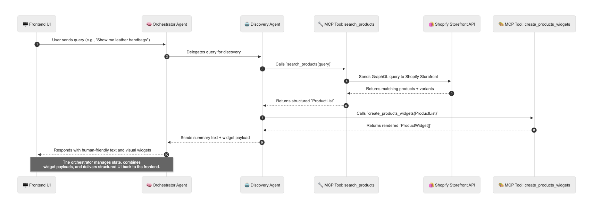
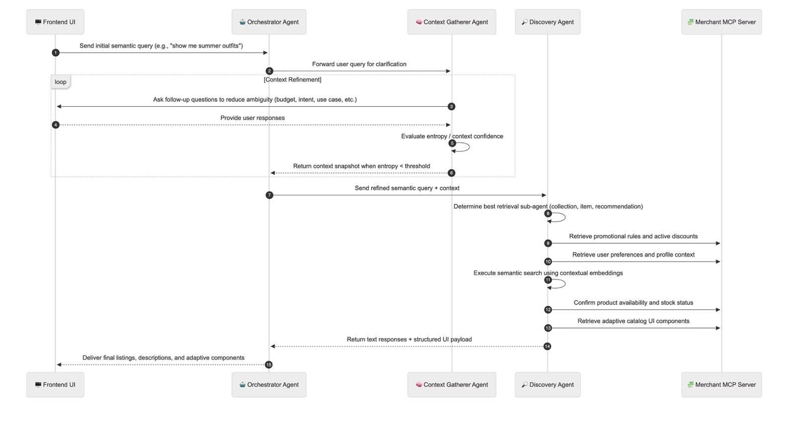

# ⚡️ Agentic Commerce Demo

> LLM-powered shopping orchestration. Real-time discovery, cart creation, and checkout via Shopify.

<video src="./docs/demo.mp4" controls width="100%" style="border-radius:12px; margin-top:12px;"></video>

---

## 🧠 Overview

A working **agentic commerce** proof-of-concept — a network of AI agents acting as autonomous shopping concierges. The backend orchestrates Shopify API calls through structured MCP tools. The frontend renders those results as live, interactive product widgets.

## 🏗 Architecture

| Layer | Stack | Purpose |
|-------|--------|----------|
| **Backend** (`agent/backend/`) | FastAPI + Google ADK | Multi-agent orchestration, tool execution, and full Shopify data pipeline |
| **Frontend** (`agent/frontend/`) | React + Vite + Tailwind | Chat-driven shopping UI that renders dynamic widgets from backend tools |
| **Integration** | ADK MCP Tools | Bridges agentic reasoning ↔ structured tool I/O ↔ storefront API |
 
### 🧱 Backend Layer Stack

| Layer | Description |
|--------|--------------|
| 🧠 **Agent Layer** (`agents/`) | Core reasoning built on **Google ADK** and **A2A Protocol**. Coordinates discovery, cart, and product detail agents. |
| ⚙️ **MCP Tools Layer** (`tools/`) | Deterministic functions following the **Model Context Protocol**, e.g. `search_products`, `create_cart_widget`. |
| 🛍 **Storefront Layer** (`client/shopify.py`) | Implements abstracted interfaces from `client/interface.py`. Executes Shopify GraphQL operations for product search, cart creation, and checkout. |

**Flow Summary**
1. The **Agent** thinks → decides → calls a tool.  
2. The **MCP Tool** executes the business action (like `search_products`).  
3. The **Interface Layer** standardizes requests/responses using typed base models.  
4. The **Storefront Client** executes the actual GraphQL query and returns normalized data.

This architecture isolates reasoning, orchestration, and I/O cleanly — allowing you to swap Shopify for any other e-commerce backend without touching agent logic.



## 🖥 Backend

### Entry Point
**`agent/backend/main.py`**
- FastAPI app with CORS.
- Endpoint: `POST /query`.
- Input:  
  ```json
  { "question": "string", "session_id": "optional" }
  ```
- Output:  
  ```json
  { "response": "string", "status": "success", "session_id": "...", "widgets": [] }
  ```
- Invokes the orchestrator agent → converts tool payloads → `widgets[]`.

### Core Types
- **`types/types.py`** — shared data models for `Product`, `Cart`, `Widget`.
- **`state/keys.py`** — registry for agent memory keys (`X-cart`, `X-shopify-cart`, `X-search-categories`, etc.).

### Orchestrator and Agents
#### 🧠 Root Agent
Root agent powered by **Gemini 2.0 Flash**, coordinating all sub-agents using `google.adk` primitives:  
`Runner`, `InMemorySessionService`, and `InMemoryArtifactService`.  
It maintains per-session chat state and converts tool payloads into UI widgets.

#### 🧭 Discovery Agent
- **Purpose:** Search for products and build product display widgets.  
- **Tools Used:**
  - `search_products(query)` — fetches product data from Shopify.  
  - `create_products_widgets(raw_prod_list)` — turns structured product data into renderable widgets.

#### 🛒 Cart Agent
- **Purpose:** Manage the user’s in-memory and Shopify carts.  
- **Tools Used:**
  - `add_item_to_cart(product_id, quantity)` — updates local cart state.  
  - `remove_item_from_cart(product_id)` — removes items.  
  - `create_shopify_cart_and_get_checkout_url()` — creates live Shopify cart and checkout link.  
  - `create_cart_widget()` — generates a visual cart summary widget.

#### 📦 Product Details Agent
- **Purpose:** Retrieve and summarize details for a specific product.  
- **Tools Used:**
  - `get_product_details(product_id)` — fetches variant details via Shopify GraphQL.  
  - `create_products_widgets()` — builds detailed product display widget.


> `create_cart_widget` and `create_products_widgets` let **merchants customize UI elements** server-side, enabling **multi-merchant storefronts** with dynamic, brand-specific layouts delivered directly from the merchant backend.

## ⚙️ Setup & Run

**Requirements**
- Python 3.12+
- Node 18+

**Env**
```bash
SHOPIFY_STOREFRONT_STORE_URL=
SHOPIFY_STOREFRONT_ACCESS_TOKEN=
SHOPIFY_ADMIN_API_STORE_URL=
SHOPIFY_ADMIN_API_ACCESS_TOKEN=
```

**Backend**
```bash
python -m venv venv
source venv/bin/activate
pip install -r requirements.txt
make agent-backend
```

**Frontend**
```bash
cd agent/frontend
npm install
npm run dev
```

### 🚀 Next Steps

- **RAG Search Layer** — Replace direct Shopify queries with a retrieval-augmented layer that indexes product embeddings for faster, context-aware search.  
  - Cache products locally.  
  - Use semantic retrieval instead of raw GraphQL text search.

- **Image Search** — Allow users to upload or paste an image to find visually similar items.  
  - Extend `search_products` to accept an optional `image_query` field.  
  - Use CLIP or Gemini Vision for embedding similarity.

- **Visualize This Look** — Let users see how cart items look together.  
  - Add a `visualize_look` tool that composes selected products into one styled image.  
  - Output as an interactive widget.

- **Context Agent** — Add a pre-discovery agent that asks clarifying questions until uncertainty (entropy) drops below a threshold.  
  - Measures information gain per question.  
  - Only proceeds to product retrieval when confidence in user intent is high.

- **Promos MCP Server** — Introduce a new MCP server for **merchant-driven business rules**.  
  - Lets merchants dynamically inject promotion logic, preferences, or ranking strategies into the agent flow.  
  - Controls which items are emphasized or hidden based on business objectives (e.g., margin, stock, campaign priority).


